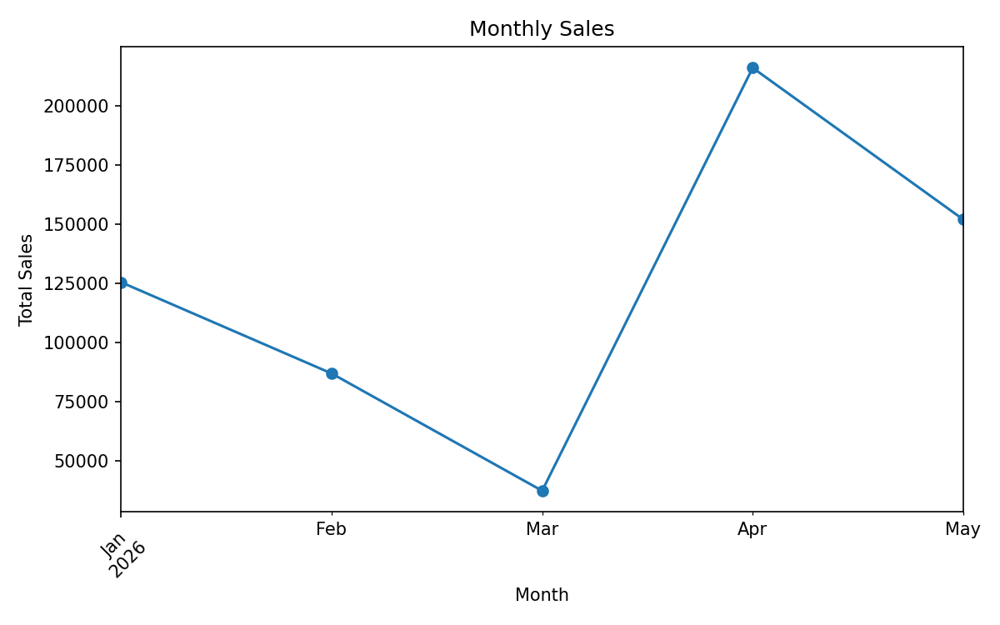
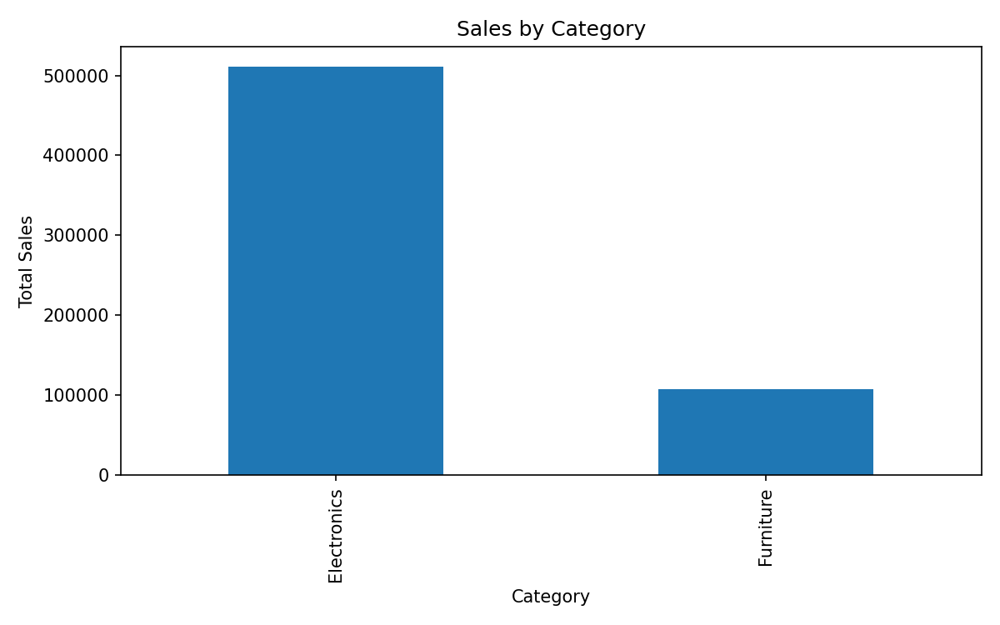

# Sales Data Analysis

A Python data analysis project that uses Pandas and Matplotlib to analyze sales data, identify business trends, and create visualizations.

## Project Overview

This project analyzes a sample sales dataset to understand sales performance across different products, categories, and months.

The analysis includes data loading, data exploration, sales calculations, and visualizations to present useful business insights.

## Features

* Load sales data from a CSV file
* Explore and analyze the dataset using Pandas
* Calculate total sales
* Analyze product and category performance
* Analyze monthly sales trends
* Create sales visualizations using Matplotlib
* Store charts for easy viewing

## Technologies Used

* Python
* Pandas
* Matplotlib
* CSV
* Data Analysis
* Data Visualization

## Dataset

The dataset contains the following information:

* Date
* Product
* Category
* Quantity
* Price
* Sales

## Visualizations

### Monthly Sales



### Sales by Category



## Project Structure

```text
Sales-Data-Analysis-Project/
│
├── README.md
├── sales-analysis.py
├── sales-data.csv
├── monthly_sales.png
├── sales_by_category.png
├── requirements.txt
└── .gitignore
```

## How to Run

### 1. Clone the repository

```bash
git clone <your-repository-url>
cd Sales-Data-Analysis-Project
```

### 2. Install dependencies

```bash
pip install -r requirements.txt
```

### 3. Run the analysis

```bash
python sales-analysis.py
```

## Analysis Performed

The project performs basic sales data analysis to identify:

* Overall sales performance
* Sales by category
* Monthly sales trends
* Product-level performance
* Useful patterns in the dataset

## Future Improvements

* Add interactive Plotly dashboards
* Add more advanced statistical analysis
* Add regional sales analysis
* Add profit and revenue metrics
* Build an interactive dashboard using Streamlit


